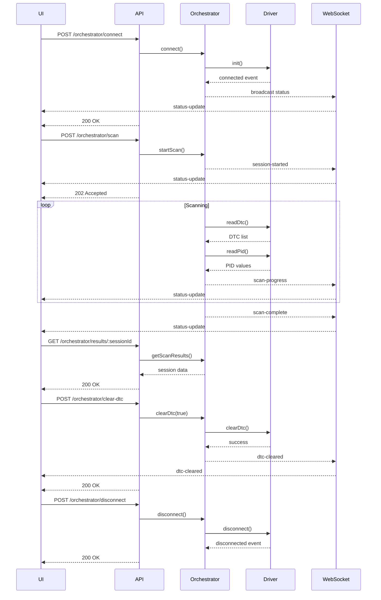

# OBD-II Orchestration API Documentation

## Overview

The OBD-II Orchestration API provides REST and WebSocket endpoints for managing diagnostic sessions. The orchestration layer sits between the UI and the low-level OBD driver, managing state machines, sessions, and real-time updates.

## Base URL

```
http://localhost:3000
```

## Architecture

```
Frontend (UI)
    ↓
REST API / WebSocket
    ↓
ObdOrchestrator (State Machine)
    ↓
DeviceObd (Driver Interface)
    ↓
ELM327 Adapter / Mock Device
```

## State Machine

The orchestrator manages the following states:

- `DISCONNECTED`: Initial state, no adapter connection
- `CONNECTING`: Attempting to connect to adapter
- `CONNECTED`: Connected and ready to scan
- `SCANNING`: Diagnostic scan in progress
- `RESULTS_READY`: Scan completed, results available
- `IDLE`: Waiting for next command
- `ERROR`: Error occurred, requires reconnection

## REST API Endpoints

### Connect to Adapter

Establishes connection with OBD-II adapter.

```http
POST /api/obd/orchestrator/connect
```

**Response:**

```json
{
  "status": "connected"
}
```

**Errors:**

- `503`: Connection failed or adapter unavailable
- `500`: Internal error

**Example:**

```bash
curl -X POST http://localhost:3000/api/obd/orchestrator/connect
```

### Start Diagnostic Scan

Initiates a new diagnostic session.

```http
POST /api/obd/orchestrator/scan
Content-Type: application/json
```

**Request Body:**

```json
{
  "vehicleMake": "Toyota",
  "vehicleModel": "Camry"
}
```

**Response:**

```json
{
  "sessionId": "550e8400-e29b-41d4-a716-446655440000",
  "status": "scanning"
}
```

**Errors:**

- `400`: Invalid state or request payload
- `409`: Maximum concurrent sessions reached
- `500`: Scan failed

**Example:**

```bash
curl -X POST http://localhost:3000/api/obd/orchestrator/scan \
  -H "Content-Type: application/json" \
  -d '{"vehicleMake": "Toyota", "vehicleModel": "Camry"}'
```

### Get Status

Returns current orchestrator status.

```http
GET /api/obd/orchestrator/status
```

**Response:**

```json
{
  "currentStatus": "SCANNING",
  "sessionId": "550e8400-e29b-41d4-a716-446655440000",
  "progress": 45,
  "message": "Reading PIDs"
}
```

**Example:**

```bash
curl http://localhost:3000/api/obd/orchestrator/status
```

### Get Scan Results

Retrieves results for a completed session.

```http
GET /api/obd/orchestrator/results/:sessionId
```

**Response:**

```json
{
  "session": {
    "sessionId": "550e8400-e29b-41d4-a716-446655440000",
    "startTime": 1704067200000,
    "endTime": 1704067260000,
    "status": "completed",
    "dtcList": [
      {
        "code": "P0420",
        "category": "P",
        "description": "Catalyst System Efficiency Below Threshold",
        "rawBytes": "0420"
      }
    ],
    "pidSnapshots": [
      {
        "timestamp": 1704067210000,
        "rpm": 1500,
        "speed": 60,
        "coolantTemp": 85,
        "intakeTemp": 25,
        "throttle": 30
      }
    ],
    "metadata": {
      "vehicleMake": "Toyota",
      "vehicleModel": "Camry"
    }
  }
}
```

**Errors:**

- `404`: Session not found
- `500`: Internal error

**Example:**

```bash
curl http://localhost:3000/api/obd/orchestrator/results/550e8400-e29b-41d4-a716-446655440000
```

### Clear DTC Codes

Clears diagnostic trouble codes from the vehicle's ECU.

```http
POST /api/obd/orchestrator/clear-dtc
Content-Type: application/json
```

**Request Body:**

```json
{
  "confirm": true
}
```

**Response:**

```json
{
  "success": true,
  "timestamp": "2024-01-01T12:00:00.000Z"
}
```

**Errors:**

- `400`: Confirmation required or invalid state
- `500`: Clear operation failed

**Example:**

```bash
curl -X POST http://localhost:3000/api/obd/orchestrator/clear-dtc \
  -H "Content-Type: application/json" \
  -d '{"confirm": true}'
```

### Disconnect

Disconnects from the OBD-II adapter.

```http
POST /api/obd/orchestrator/disconnect
```

**Response:**

```json
{
  "status": "disconnected"
}
```

**Example:**

```bash
curl -X POST http://localhost:3000/api/obd/orchestrator/disconnect
```

## WebSocket API

### Connection

```javascript
const ws = new WebSocket('ws://localhost:3000/ws/obd');
```

### Message Types

#### Status Update

Sent when orchestrator state changes or scan progress updates.

```json
{
  "type": "status-update",
  "payload": {
    "status": "SCANNING",
    "sessionId": "550e8400-e29b-41d4-a716-446655440000",
    "progress": 45,
    "message": "Reading PIDs"
  }
}
```

#### DTC Cleared

Sent when DTC codes are successfully cleared.

```json
{
  "type": "dtc-cleared",
  "payload": {
    "sessionId": "550e8400-e29b-41d4-a716-446655440000",
    "success": true,
    "timestamp": "2024-01-01T12:00:00.000Z"
  }
}
```

#### Error

Sent when an error occurs.

```json
{
  "type": "error",
  "payload": {
    "message": "Scan timeout",
    "timestamp": "2024-01-01T12:00:00.000Z"
  }
}
```

### Heartbeat

The server sends ping frames every 30 seconds. Clients should respond with pong frames to maintain the connection.

### Example Client

```javascript
const ws = new WebSocket('ws://localhost:3000/ws/obd');

ws.onopen = () => {
  console.log('Connected to OBD WebSocket');
};

ws.onmessage = (event) => {
  const message = JSON.parse(event.data);
  
  switch (message.type) {
    case 'status-update':
      console.log('Status:', message.payload.status);
      console.log('Progress:', message.payload.progress);
      break;
    case 'dtc-cleared':
      console.log('DTC cleared:', message.payload.success);
      break;
    case 'error':
      console.error('Error:', message.payload.message);
      break;
  }
};

ws.onerror = (error) => {
  console.error('WebSocket error:', error);
};

ws.onclose = () => {
  console.log('Disconnected from OBD WebSocket');
};
```

## Typical Flow Sequence



## Error Codes

| Code | Description | HTTP Status |
|------|-------------|-------------|
| `connection_failed` | Failed to connect to adapter | 503 |
| `invalid_state` | Invalid operation for current state | 400 |
| `max_sessions_reached` | Maximum concurrent sessions limit | 409 |
| `confirmation_required` | DTC clear requires confirmation | 400 |
| `session_not_found` | Session ID not found | 404 |
| `clear_dtc_failed` | Failed to clear DTC codes | 500 |
| `disconnect_failed` | Failed to disconnect | 500 |

## Configuration

Configuration is loaded from `config/obd-orchestrator.json`:

```json
{
  "scanTimeout": 120000,
  "pidPollInterval": 500,
  "pidPollDuration": 10000,
  "sessionTTL": 3600000,
  "supportedPids": ["0C", "0D", "05", "0F", "11"],
  "maxConcurrentSessions": 1
}
```

## Prometheus Metrics

The orchestrator exposes the following metrics at `/metrics`:

- `obd_sessions_total`: Total number of sessions started
- `obd_scans_completed_total`: Total number of successful scans
- `obd_scans_failed_total`: Total number of failed scans (with reason label)
- `obd_dtc_cleared_total`: Total number of DTC clear operations
- `obd_scan_duration_seconds`: Histogram of scan durations

## Troubleshooting

### Connection Issues

If connection fails:

1. Check adapter is plugged in and powered
2. Verify correct port in environment variable `OBD_PORT`
3. Check adapter is ELM327 compatible
4. Review logs for detailed error messages

### Scan Timeout

If scans timeout:

1. Increase `scanTimeout` in configuration
2. Check adapter communication reliability
3. Verify vehicle ignition is on
4. Check for interference on serial connection

### No Results

If no DTC or PID data:

1. Verify vehicle has active trouble codes
2. Check supported PIDs for vehicle protocol
3. Review driver logs for communication errors
4. Ensure vehicle protocol is supported

### WebSocket Disconnects

If WebSocket frequently disconnects:

1. Check network stability
2. Implement client-side reconnection logic
3. Monitor heartbeat responses
4. Review server logs for errors

## Development Mode

In DEV mode (`AGENT_ENV=DEV`):

- Mock device is used instead of real adapter
- Scenarios can be configured for testing
- Debug logging is enabled
- Detailed error information is returned

## Production Mode

In PROD mode (`AGENT_ENV=PROD`):

- Real adapter connection required
- Info-level logging only
- Generic error messages returned
- Mock device unavailable
